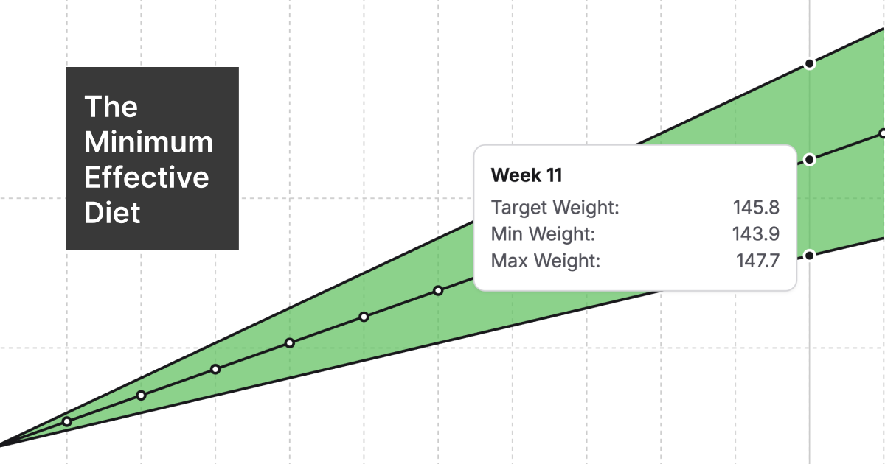

# The Minimum Effective Diet

Make four simple choices and get an evidence-based diet plan in return.



The Minimum Effective Diet aims to be a foolproof way for someone to get started on a weight gain or weight loss journey they can trust to be evidence-based, effective, and safe.

Fill in current weight, direction, target weekly rate, and duration, and the app presents a projected weight curve, calorie targets for each kind of training day, a full macro breakdown, and a "green zone" your weekly weight average should stay inside.

## Local Development

```sh
bun install
bun run dev       # local dev server
bun run test      # vitest, incl. the full input-space sweep
bun run build     # typecheck + production bundle
bun run lint      # oxlint
bun run format    # oxfmt
```

## Credits

Percentage ranges, week ranges, and calorie estimates are from
[The Renaissance Diet 2.0](https://rpstrength.com/products/rp-diet-book-v2)
(unaffiliated). Not medical advice — see the disclaimer in the app.
